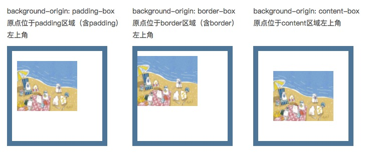
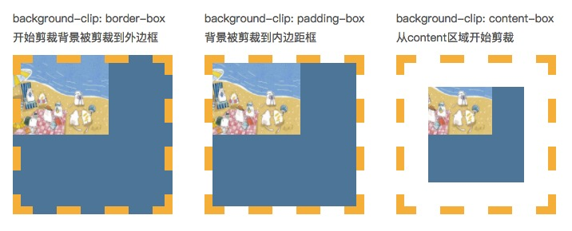

## 黑白配色
- 若 filter 属性的值不是 none，会给「绝对和固定定位的后代」创建一个 containing block，除非它适用的元素是当前浏览上下文中的文档根元素（即<html>）。
- `filter: grayscale(1)`
- 兼容处理
  ```css
    .gray {
        -webkit-filter: grayscale(100%);
        -moz-filter: grayscale(100%);
        -ms-filter: grayscale(100%);
        -o-filter: grayscale(100%);
        filter: grayscale(100%);
        -webkit-filter: gray;
        filter: gray;
        -webkit-filter: progid:dximagetransform.microsoft.basicimage(grayscale=1);
        filter: progid:dximagetransform.microsoft.basicimage(grayscale=1);
    }
  ```
- 部分变灰（保留不变灰元素）
  - `backdrop-filter`是让当前元素所在区域`后面`的内容模糊灰度或高亮之类,可以通过z-index属性实现z-index高于html的元素不灰  
  ```css
    html::before {
      content: "";
      position: fixed; // 设置为absolute可实现首屏灰
      backdrop-filter: grayscale(100%);
      pointer-events: none;
      inset: 0;
      z-index: 100;
    }
    .not-gray{ //不置灰的元素
      position: relative;
      z-index:1000;
    }
  ```
  - 使用js递归设置属性


## 平滑滚动到指定元素
```js
document.getElementById("payment-title").scrollIntoView(alignToTop,{ // alignToTop 为true 与元素顶部对齐，false为底部对齐
  behavior: "smooth",
});
```

## background属性
- `background-color` 背景颜色
- `background-img` 背景图片
- `background-repeat` 背景重复
  - repeat，表示一直重复平铺图片；
  - no-repeat，表示不重复图片；
  - repeat-x，表示水平方向重复平铺图片；
  - epeat-y，表示垂直方向重复平铺图片；
  - inherit，表示从父元素继承repeat值；
- `background-size` 背景大小（IE8以下不支持该属性；）
  - auto 默认值
  - 长度 百分比
  - cover 较短的边等于容器的边时, 停止缩放
  - contain 较长的边等于容器的边时, 停止缩放
- `background-positon` 位置
  - top|right|bottom|left 两个值
  - 百分比 两个值
  - px 两个值
- `background-origin` 相对位置
  - border-box，边框盒。
  - padding-box，内边距框。默认值
  - content-box，内容框。
  
  
- `background-clip` 背景绘制的区域
  - border-box，背景被裁剪到边框盒。
  - padding-box，背景被裁剪到内边距框。
  - content-box，背景被裁剪到内容框。
  

- `background-attachment` 背景是否固定滚动
  - fixed|scroll|inherit 可选值

## 移动端适配
### flexible+rem
- rem是相对于html节点的font-size来做计算的一个相对单位，在运行时动态修改html节点的font-size大小，从而影响所有使用rem单位的布局。
- 375px的设计稿为10rem，1rem为37.5px
- 一个`lib-flexible`库,保证在所有资源加载之前执行这个JS
- html的font-size设置到12px以下还是会按照12px=1rem来计算，这样所有使用了rem单位的尺寸都是错的。
- 媒体查询
  ```css
  html {
    font-size: 50px
  }
  @media only screen and (min-device-width: 375px) and (-webkit-min-device-pixel-ratio: 2) {
    html {
      font-size: 37.5px
    }
  }
  @media only screen and (min-device-width: 360px) and (-webkit-min-device-pixel-ratio: 3) {
    html {
      font-size: 36px
    }
  } 
  ```
- js
  ```js
  // set 1rem = viewWidth / 10
  function setRemUnit () {
     var rem = docEl.clientWidth / 10
     docEl.style.fontSize = rem + 'px'
  }
  window.onload = function(){
     setRemUnit()
  };
  window.onresize = function(){
     setRemUnit()
  }; 
  ```

### vw
- vw(viewport's width)：1vw等于视觉视口的1%
- h(viewport's height) : 1vh 为视觉视口高度的1%
- vmin: vw 和 vh 中的较小值
- vmax: 选取 vw 和 vh 中的较大值
- vscode中使用px2vw、px-to-vw插件
- postCSS的postCSS-px-to-viewport插件
  ```js
    module.exports = {
       plugins: {
           'autoprefixer': {},
           'postcss-px-to-viewport': {
               viewportWidth: 750,      // 视窗的宽度，对应的是我们设计稿的宽度，一般是750
               viewportHeight: 1334,    // 视窗的高度，根据750设备的宽度来指定，一般指定1334，也可以不配置
               unitPrecision: 3,        // 指定`px`转换为视窗单位值的小数位数（很多时候无法整除）
               viewportUnit: 'vw',      // 指定需要转换成的视窗单位，建议使用vw
               selectorBlackList: ['.ignore', '.hairlines'],  // 指定不转换为视窗单位的类，可以自定义，可以无限添加,建议定义一至两个通用的类名
               minPixelValue: 1,       // 小于或等于`1px`不转换为视窗单位，你也可以设置为你想要的值
               mediaQuery: false       // 允许在媒体查询中转换`px`
           }
       }
    } 
  ```
- 当容器使用vw，margin采用px时，很容易造成整体宽度超过100vw，从而影响布局效果。当然我们也是可以避免的，例如使用padding代替margin，结合calc()函数使用等等...

### 横屏适配
- js可以通过window.orientation获取屏幕旋转方向，屏幕旋转后页面宽高发生变化，会触发resize事件。
  ```js
  window.addEventListener("resize", ()=>{
     if (window.orientation === 180 || window.orientation === 0) {
       // 正常方向或屏幕旋转180度
         console.log('竖屏');
     };
     if (window.orientation === 90 || window.orientation === -90 ) {
       // 屏幕顺时钟旋转90度或屏幕逆时针旋转90度
         console.log('横屏');
     }  
  }); 
  ```

- CSS也可以检测到屏幕旋转
  ```css
  @media screen and (orientation: portrait) {
     /*竖屏...*/
  }
  @media screen and (orientation: landscape) {
     /*横屏...*/
  } 

  ```

### 1px问题
- 产生原因：移动设备普遍的设备像素比（dpr）为2或3，1pxCSS像素实际渲染为2（3）物理像素，所以视觉效果比较粗。注意这里是视觉效果比较粗
- 方案1 伪元素+transform
  ```css
  .border_1px:before{
     content: '';
     position: absolute;
     top: 0;
     height: 1px;
     width: 100%;
     background-color: #000;
     transform-origin: 50% 0%;
  }
  @media only screen and (-webkit-min-device-pixel-ratio:2){
     .border_1px:before{
         transform: scaleY(0.5);
     }
  }
  @media only screen and (-webkit-min-device-pixel-ratio:3){
     .border_1px:before{
         transform: scaleY(0.33);
     }
  } 

  ```
方案2 border-image或background-image（需要切图）
  ```css
  /* border-image */
  .border_1px {
     border-bottom: 1px solid #000;
  }
  @media only screen and (-webkit-min-device-pixel-ratio:2){
     .border_1px {
         border-bottom: none;
         border-width: 0 0 1px 0;
         border-image: url(../img/1px_line.png) 0 0 2 0 stretch;
     }
  }

  /* background-image */
  .border_1px {
     border-bottom: 1px solid #000;
  }
  @media only screen and (-webkit-min-device-pixel-ratio:2){
     .border_1px{
         background-image: url(../img/1px_line.png) repeat-x left bottom;
         background-size: 100% 1px;
     }
  } 
  ```

方案3 使用SVG作为border-image或者background-image，需要借助PostCSS的postcss-write-svg插件
  ```css
  @svg border_1px {
   height: 2px;
   @rect {
     fill: var(--color, black);
     width: 100%;
     height: 50%;
     }
   }
  }
  .example {
   border: 1px solid transparent;
   border-image: svg(border_1px param(--color #00b1ff)) 2 2 stretch;
  } 

  /* 编译后 */
  .example { 
    border: 1px solid transparent; 
    border-image: url("data:image/svg+xml;charset=utf-8,%3Csvg xmlns='http://www.w3.org/2000/svg' height='2px'%3E%3Crect fill='%2300b1ff' width='100%25' height='50%25'/%3E%3C/svg%3E") 2 2 stretch; } 
  ```
  
