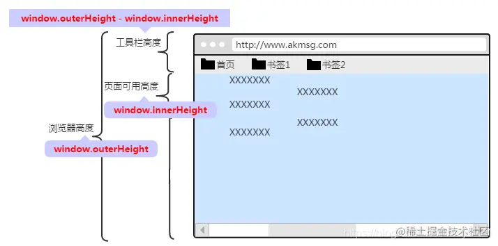

# IntersectionObserver
## API
```js
var io = new IntersectionObserver(callback, option);

// 开始观察
io.observe(document.getElementById('example'));

// 停止观察
io.unobserve(element);

// 关闭观察器
io.disconnect();
```

- callback 可见性变化时的回调函数
  ```js
    var io = new IntersectionObserver(
      entries => {
        console.log(entries); // entries 是一个数组，每项都表示被监听的对象
      }
    );
    // entrie
    {
      time: 3893.92,
      rootBounds: ClientRect {
        bottom: 920,
        height: 1024,
        left: 0,
        right: 1024,
        top: 0,
        width: 920
      },
      boundingClientRect: ClientRect {
         // ...
      },
      intersectionRect: ClientRect {
        // ...
      },
      intersectionRatio: 0.54,
      target: element
    }
  ```
  - time：可见性发生变化的时间，是一个高精度时间戳，单位为毫秒
  - target：被观察的目标元素，是一个 DOM 节点对象
  - rootBounds：根元素的矩形区域的信息，getBoundingClientRect()方法的返回值，如果没有根元素（即直接相对于视口滚动），则返回null
  - boundingClientRect：目标元素的矩形区域的信息
  - intersectionRect：目标元素与视口（或根元素）的交叉区域的信息
  - intersectionRatio：目标元素的可见比例，即intersectionRect占boundingClientRect的比例，完全可见时为1，完全不可见时小于等于0


- option是配置对象（该参数可选)
  - `threshold`属性决定了什么时候触发回调函数。它是一个数组，每个成员都是一个门槛值，默认为[0]，即交叉比例（intersectionRatio）达到0时触发回调函数。
  - `root`指定目标元素所在的容器节点（即根元素）, `rootMargin`定义根元素的margin，用来扩展或缩小rootBounds这个矩形的大小，从而影响intersectionRect交叉区域的大小
- 构造函数的返回值是一个观察器实例
- 实例的observe方法可以指定观察哪个 DOM 节点,如果要观察多个节点，就要多次调用这个方法。

## 兼容插件
- [intersection-observer](https://www.npmjs.com/package/intersection-observer)
- [intersection-observer-polyfill](https://www.npmjs.com/package/intersection-observer-polyfill)
## 使用示例

- 懒加载
```js
import IntersectionObserver from 'intersection-observer-polyfill'
import 'intersection-observer' 

let __io__ = null

const intersectionHandler = function (entries) {
    for (const entry of entries) {
        if (
            // 正在交叉
            entry.isIntersecting
        ) {
            const listeners = entry.target.__intersectionListener__ || []
            if (listeners.length) {
                listeners.forEach(fn => {
                    fn()
                    __io__.unobserve(entry.target)
                    entry.target.__isNew__ = false
                })
            }
        }
    }
}

export const addIntersectionListener = function (element, fn, catchFn) {
    try {
        if (!element.__intersectionListener__) {
            element.__intersectionListener__ = []
            // dom加载后加载文件 new IntersectionObserver实例
            if (!__io__) {
                __io__ = new IntersectionObserver(intersectionHandler, {
                    rootMargin: '0px 0px',
                    root: null,
                    threshold: [0],
                })
            }
            if (!element.__isNew__) {
                __io__.observe(element)
                element.__isNew__ = true
            }
        }
        element.__intersectionListener__.push(fn)
    } catch (error) {
        catchFn()
    }
}

export const refreshIntersectionListener = function (element, catchFn) {
    try {
        if (!element.__isNew__) {
            __io__.observe(element)
        }
    } catch (error) {
        catchFn()
    }
}

export const removeIntersectionListener = function (element) {
    if (!element || !element.__intersectionListener__ || element.__isNew__ === undefined) return
    element.__intersectionListener__ = null
    element.__isNew__ = null
    disconnectIntersectionListener()
}

export const disconnectIntersectionListener = function () {
    if (__io__ && __io__.disconnect) {
        __io__.disconnect()
        __io__ = null
    }
}


```


# 浏览器视口API
### 设备（显示器）

- `window.screen.height`  
- `window.screen.availHeight`  屏幕的可用高度，一般是显示屏高度减去显示屏任务栏的高度


## 浏览器窗口

- `window.outerHeight` 浏览器的高度，高度改变，会改变值的大小

- `window.innerHeight`  浏览器的可用高度 = 浏览器高度 - 顶部工具栏 ,若有调试面板还会再减去调度面板的高度，最后得出的才是可用高度

## body
- `document.body.clientHeight`  body的高度


## 网页
- `document.body.scrollHeight` 网页可见高度加上未显示的网页的高度（滚动条未显示部分）,与`document.body.clientHeight`结果基本一致

## 滚动条
- `document.body.scrollTop || document.documentElement.scrollTop`  获取滚动条到顶部的距离
- `document.body.scrollLeft || document.documentElement.scrollLeft` 获取滚动条到左边的距离

## 元素相对于视窗
- `element.getBoundingClientRect().top || element.offsetTop` 


